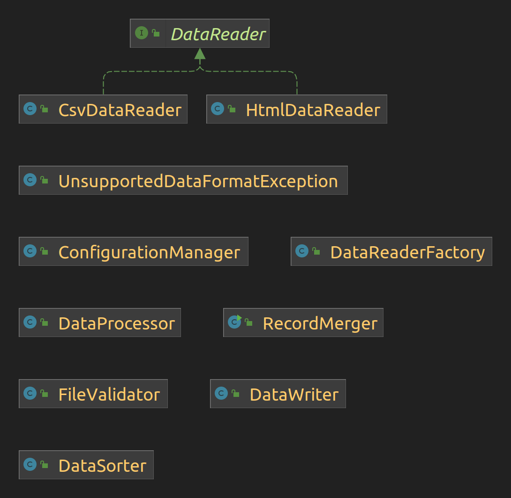

This repository contains a Java program designed to merge data from various file formats, such as HTML and CSV, into a single file. The program ensures extensibility for future support of additional file types and offers ease of maintenance. It handles diverse data sets, supporting multiple languages, and provides an efficient solution for consolidating information while maintaining data integrity.

## Testing
All tests are placed in the `src/test/java` directory. Tests can be executed by running the following bash script:
```console
./test.sh
```

## Running The Application
Please read the [assumptions](#assumptions) below.

Example 1:
```bash
./run.sh first.html second.csv
```
Expected Output:
```console
File first.html was read successfully
File second.csv was read successfully
Data has been written to data/combined.csv
```

Example 2:
```bash
./run.sh first.html second.csv test/third.xml test/too_large.csv test/without-directory.html test/empty.csv non-existent.html
```
Expected Output:
```console
File first.html was read successfully
File second.csv was read successfully
File: test/third.xml, Issue: Unsupported file format: xml
File: test/too_large.csv, Issue: File size exceeds the limit.
File: test/without-directory.html, Issue: Table with id 'directory' not found in the HTML file
File: test/empty.csv, Issue: CSV file is empty.
File: non-existent.html, Issue: File does not exist.
Data has been written to data/combined.csv
```

## Assumptions
### Input Validations
- The application can be run with one or more command-line arguments. If no arguments are provided, the program will exit immediately.
- **Important:** All data files are looked for in a designated <i>safe</i> folder, which I set as default the `data/` directory. 
This can be configured in `config.properties`:
```properties
app.data.directory=data
```
- For example, if user provides `first.html`, the program will look for that in `data/first.html`.
I did this to ensure that file path is safe. For example, if user provides `../logs/application.log`,
  this will be ignored and logged as a malicious attempt (SecurityException) because the canonical path
becomes `logs/application.log` which is outside the <i>safe</i> directory `/data`.

- The system will also check for maximum file size which can also be configured in `config.properties`.
```properties
app.max.file.size.bytes=1048576
```
> If file is not found in `data/` directory, format is not supported, file size is too large, or 
> an empty or invalid file is given, that file is ignored, exception is logged and printed, and next file is processed.

### Consolidating
- If HTML file has no table with `id="directory"`, that file is not parsed.
- **Column names are lower-cased** so that data from different files having the same column name 
do not result in duplicate columns. "Name", "NAME", "name" will all be "name" in `combined.csv`.
- If HTML table has no `id` header or CSV has no `id` column, data is still read and consolidated.
    Since data is sorted by ID, rows with missing id are placed at the bottom.
    - <b>Rationale</b>: I've done it this way so that client can decide what to do with data 
  without id. They may generate ids for those rows, or simply remove them from the bottom of `combined.csv`.

### Sorting  
- For sorting, I have followed "natural sorting", which takes into account both letters and digits 
within filenames, allowing for a more human-friendly sorting order.
    - Numbers are sorted numerically, so "11" comes after "2" because it is considered a higher numeric value. 
    - Letters are sorted based on their Unicode values.
    - Data in non-English language are read and consolidated, but their IDs are not translated.
  For example, `"七"` means `7` in Chinese. But this will not come after `6`, rather this will be 
  placed after all the alphanumerical IDs.

## Extensibility
I have <b>programmed to an interface</b> like the following:

```java
public interface DataReader {
    List<Map<String, String>> readData(String filePath);
}

public class HtmlDataReader implements DataReader {
    @Override
    public List<Map<String, String>> readData(String filePath) {
        // my code here
    }
}
```
Then, I have a `Factory` method that provides me the right `DataReader` object:
```java
public class DataReaderFactory {
    public static DataReader createDataReader(String filePath) throws ... {
        String fileExtension = FilenameUtils.getExtension(filePath).toLowerCase();

        switch (fileExtension) {
            case "html":
                return new HtmlDataReader();
            case "csv":
                return new CsvDataReader();
            default:
                throw new UnsupportedDataFormatException(
                        "Unsupported file format: " + fileExtension);
        }
    }
}
```

Adding more file supports should be as easy as implementing DataReader and adding another case to the switch statement.
```java
public class XmlDataReader implements DataReader {
    @Override
    public List<Map<String, String>> readData(String filePath) {
        // future code for reading XML data
    }
}
```

### Configuration at Runtime
I have placed `config.properties` file in the "src/main/resources" directory for effortless 
configuration management. For instance, we can use it to specify the data directory for data retrieval:
```java
String dataDir = configManager.getProperty("app.data.directory", "data");
```
Either it will find the property and return it, or it will use the default value passed as the second parameter.

But, most importantly, this gives us the flexibility to configure settings at runtime.
```bash
java -cp cantest.jar:lib/* -Dactive.profile=qa com.veeva.core.RecordMerger valid.html
```
The above command specifies `active.profile=qa` at runtime which will load `config-qa.properties` file
and override the values in `config.properties` if there is a collision. 
#### config-qa.properties
```properties
app.data.directory=data/test
```

Now, the application will look for data at the `data/test` directory.

### Logging
I am using Log4j with [RollingFileAppender](https://logging.apache.org/log4j/2.x/manual/appenders.html#rollingfileappender) 
with a rolling policy based on time (daily). Logs are stored in the `logs/` folder.

### Package Structure
```my-java-project/
...
|-- src/main/java
| |-- com.veeva/
| | |-- config/
| | | |-- ConfigurationManager.java
| | |-- core/
| | | |-- RecordMerger.java
| | |-- data/
| | | |-- reader/
| | | | |-- CsvDataReader.java
| | | | |-- DataReader.java
| | | | |-- DataReaderFactory.java
| | | | |-- HtmlDataReader.java
| | | |-- DataProcessor.java
| | | |-- DataSorter.java
| | | |-- DataWriter.java
| | |-- exceptions/
| | | |-- UnsupportedDataFormatException.java
| | |-- validator/
| | | |-- FileValidator.java
...
```

- RecordMerger: The main class responsible for taking user-input files and initiating the merging process.
- FileValidator: Handles the validation of file paths and sizes to ensure data integrity.
- DataProcessor: Performs the data merging process by leveraging the DataReaderFactory to obtain 
a suitable DataReader and consolidating data from multiple files.
- DataReaderFactory: A factory method that provides an appropriate DataReader object based on the file format.
- DataReader:  An interface defining the contract for reading data.
- CsvDataReader:  An implementation of the DataReader interface that specializes in reading CSV data.
- HtmlDataReader: An implementation of the DataReader interface tailored for reading HTML data.
- DataSorter: Sorts data by id in a "natural" ascending order.
- DataWriter: Manages the task of writing data to an output CSV file.
- ConfigurationManager: Offers utilities for managing and accessing configuration properties 
defined in the `config.properties` files.


